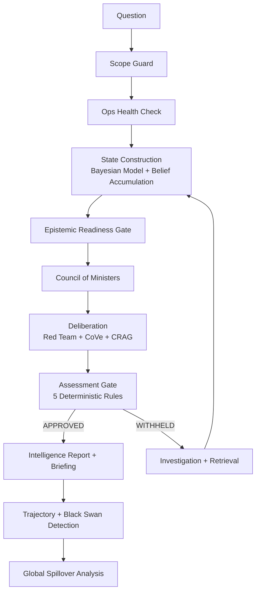

# IND-Diplomat

**A geopolitical risk analysis engine that reasons like an intelligence analyst — structured, evidence-grounded, and self-correcting — built to evolve into a system that learns from its own predictions.**

---

IND-Diplomat collects open-source geopolitical signals, builds evidence-based state models through Bayesian inference, and produces guarded analytical assessments through a council-style reasoning pipeline with explicit gates, red-team challenge, and verification at every stage.

## What The System Does

- Collects and normalizes geopolitical signals from **15+ structured data providers** and OSINT sensors
- Builds country state context through a **Bayesian conflict-state model** (5 states: PEACE → CRISIS → LIMITED_STRIKES → ACTIVE_CONFLICT → FULL_WAR)
- Runs **council-style analysis** with 7 specialized ministers, each proposing hypotheses from different analytical perspectives
- Applies **Chain of Verification (CoVe)**, **Corrective RAG (CRAG)**, and **Red Team** challenge before any assessment is released
- Enforces a **deterministic assessment gate** — 5 rules that can withhold conclusions when evidence is insufficient
- Detects **black swan events** through 3 independent channels (spike severity, velocity, systemic cascade)
- Models **cross-theater contagion** through a global interdependence matrix with 150+ geopolitical coupling weights
- Produces intelligence-style reports with full reasoning traces, confidence framing, and evidence provenance

## Architecture



| Layer | What It Does |
|---|---|
| **Layer 1** — Sensors | OSINT, GDELT, SIPRI, WorldBank, MoltBot |
| **Layer 2** — Knowledge | Vector store, RAG, signal extraction, entity registry |
| **Layer 3** — State Model | Bayesian conflict states, belief accumulation, temporal memory |
| **Layer 4** — Analysis | Council of 7 Ministers, CoVe, CRAG, Red Team, MCTS hypothesis testing |
| **Layer 5** — Judgment | Assessment gate (5 rules), intelligence report generation, trajectory + black swan detection |
| **Layer 6** — Presentation | Full briefing, crisis replay, confidence recalibration, forecast archiving |
| **Layer 7** — Global Model | Cross-theater contagion, interdependence matrix (150+ couplings), global risk projection |

More detail in [docs/architecture.md](docs/architecture.md) and [docs/repo-map.md](docs/repo-map.md).

## Key Technical Highlights

- **Bayesian Conflict-State Model** — 5-state classification with adaptive transition matrices, per-signal-group sigma, and persistence between runs
- **Epistemic Chain** — Evidence → Observation → Belief with source reliability tiers, corroboration levels, recency decay, staleness protection, and echo deduplication
- **Signal-to-State Profiles** — Each state has expected confidence levels across 12 signal groups (military escalation, mobilization, force posture, logistics, hostility, WMD risk, instability, diplomacy, coercion, alliance, cyber, economic pressure)
- **Temporal Memory** — Tracks belief evolution over time with momentum, persistence, and spike detection
- **7 Ministers** — Security, Diplomatic, Economic, Domestic, Alliance, Strategy, Contrarian — each proposing hypotheses over state dimensions
- **Verification Pipeline** — CoVe (atomic claim decomposition), CRAG (evidence quality evaluation), Red Team (6-dimension challenge), Debate Orchestrator
- **Assessment Gate** — 5 deterministic rules (no LLM): critical PIRs, capability coverage, stale military, confidence floor, trend escalation
- **15+ Data Providers** — SIPRI, ATOP, V-Dem, OFAC, GDELT, WorldBank, Comtrade, Lowy, UCDP, EEZ, Leaders, Ports, Sanctions, MoltBot
- **Safety Architecture** — Refusal engine, HITL gate, groupthink detector, counterfactual engine

## CLI Quick Start

```bash
cd IND-Diplomat
python run.py --help

# Standard query
python run.py --country IRN "Assess the current risk of military escalation in the Persian Gulf"

# With full execution log
python run.py --verbose "Assess China-Taiwan risk"

# Quick summary only
python run.py --brief "South Asian nuclear dynamics"

# JSON output
python run.py --json --country CHN "Taiwan strait stability"

# Run experimental validation
python run.py --experiment replay
python run.py --experiment ablation
python run.py --experiment leadtime
```

## Sample Output

```
IND-DIPLOMAT  —  DUAL-TRACK INTELLIGENCE ASSESSMENT
==================================================================

  RISK LEVEL:      ELEVATED
  ESCALATION:      ██████████████░░░░░░░░░░░░░░░░ 47.3%
  CONFIDENCE:      LOW (63.1%)
  EPISTEMIC:       84.8% (evidence base quality)

  CONFLICT STATE:  ACTIVE CONFLICT (48.0%)
  14-Day P(ACTIVE_CONFLICT or FULL_WAR): 74.7%

  SRE DECOMPOSITION:
    Capability:     0.710  ×0.35  = 0.248
    Intent:         0.306  ×0.30  = 0.092
    Stability:      0.127  ×0.20  = 0.025
    Cost:           0.450  ×0.15  = 0.067
    Trend bonus:                  +0.040
    ESCALATION INDEX:              0.473

  RED TEAM: NOT ROBUST (−6.0% confidence penalty)
  ASSESSMENT STATUS: APPROVED
```

For the full assessment with council deliberation, confidence decomposition, bias detection, trajectory forecast, black swan monitoring, and global theater analysis, see [examples/sample_assessment.md](examples/sample_assessment.md).

## Experimental Validation

Three research-grade experiments built into the CLI:

- **Crisis Replay** — Day-by-day backtesting against historical crises (Ukraine 2022, Crimea 2014, Iran-US 2019, Karabakh 2020). Aggregate Brier: 0.2461 (26 data points)
- **Signal Ablation** — Remove one signal category at a time, measure SRE delta to identify which signals matter most
- **Lead Time** — Measures how many days before a crisis the system triggers ELEVATED/HIGH/CRITICAL alerts

---

## Phase-2: Autonomous Learning Intelligence (Upcoming)

Phase-1 of IND-Diplomat focused on building an explainable geopolitical analysis framework.
It introduced structured components such as signal extraction, belief accumulation, temporal state modeling, and council-style reasoning so that analytical conclusions could be traced step-by-step.

**Phase-2 explores transforming this framework into a self-improving intelligence system.**

In this stage, the Phase-1 analytical pipeline acts as an initial mentor that demonstrates structured reasoning. The goal is not for the system to permanently depend on this framework, but to use it as a starting point from which a more autonomous model can gradually develop its own reasoning patterns.

Inspired by how humans learn from experience, the system will aim to:

> **observe signals → form hypotheses → predict outcomes → compare with reality → update beliefs**

Over time this process should allow the system to refine its internal world model and improve its geopolitical analysis through continuous observation and feedback.

### Current Exploration

Work in Phase-2 currently focuses on investigating architectures that allow the system to:

- Learn from prediction outcomes and adjust internal belief weights
- Detect patterns in accumulated geopolitical signals
- Store hypotheses and evaluate their reliability over time
- Experiment with continuous learning mechanisms

### Planned Components

The upcoming Phase-2 work will explore:

- **Autonomous Signal Discovery** — Identifying and ingesting new geopolitical signals from external data sources
- **Hypothesis Generation** — Creating candidate explanations for patterns observed in global events
- **Prediction and Evaluation** — Testing hypotheses by comparing predictions with future events
- **Belief Updating** — Revising internal models when predictions fail or new evidence appears
- **Knowledge Consolidation** — Stabilizing reliable patterns as part of the system's long-term knowledge

### Long-Term Direction

The long-term objective is to evolve IND-Diplomat from a deterministic analytical pipeline into a **persistent geopolitical world-model** capable of improving its reasoning through experience — loosely inspired by how humans learn from observation and feedback.

See [docs/phase2.md](docs/phase2.md) for deeper detail.

---

## Requirements

- Python 3.12+
- Ollama (local LLM — optional, falls back to pressure-based reasoning)
- ChromaDB, sentence-transformers

See `system_bootstrap/requirements.txt` for the full dependency list.

## Contact / Collaboration

This project is under active development and feedback is welcome.

- GitHub Issues: open an issue in this repository for questions, bugs, or collaboration requests
- Email: `ak612520208365@gmail.com`
