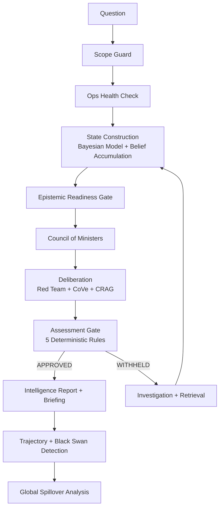

# IND-Diplomat

**A research prototype exploring structured geopolitical reasoning using probabilistic state models and multi-agent analytical debate.**

---

IND-Diplomat collects open-source geopolitical signals, builds evidence-based state models through Bayesian inference, and produces structured analytical assessments through a council-style reasoning pipeline with explicit gates, challenge mechanisms, and verification steps.

## Research Contribution

IND-Diplomat explores whether structured analytical pipelines can act as mentor systems for learning architectures that gradually develop their own reasoning patterns through interaction with real-world signals.

The project investigates three research questions:

1. Can probabilistic state models improve geopolitical risk forecasting?
2. Can multi-agent analytical debate reduce reasoning errors in AI analysis?
3. Can deterministic reasoning frameworks provide training signals for autonomous learning systems?

## System Overview

```text
Signals
   ↓
Evidence Processing
   ↓
Bayesian State Model
   ↓
Council Deliberation
   ↓
Assessment Gate
   ↓
Intelligence Report
   ↓
Learning Loop (Phase-2)
```

## Core Model

**Bayesian Conflict-State Model**

`PEACE → CRISIS → LIMITED_STRIKES → ACTIVE_CONFLICT → FULL_WAR`

The state model uses:

- an expert-initialized transition matrix
- posterior updates conditioned on observed signal groups
- persistence between runs through stored prior state probabilities

At a high level, the Bayesian update follows:

`Posterior(state) ∝ Prior(state) × Likelihood(signals | state)`

## Methodology

The system combines three core components:

- a Bayesian conflict-state model for probabilistic state estimation
- a multi-agent deliberation layer for structured analytical debate
- deterministic assessment gates for epistemic safety and explicit withholding

Together these components form a layered analytical pipeline that produces forecasts and assessments which can later be evaluated against historical outcomes and future forecast resolution.

## Goal

Build an AI system that can analyze geopolitical signals, form hypotheses, test them against evidence, and update its internal belief model through forecast outcomes and structured feedback.

## Why This Project Exists

Most AI systems rely on static models and opaque outputs. IND-Diplomat explores a different approach: a reasoning system that combines probabilistic state estimation, structured analytical debate, explicit evidence thresholds, and learning-oriented feedback loops so that conclusions can be inspected, challenged, and improved over time.

## Example Analysis

```text
Input signal:
China naval drills near the Taiwan Strait

System reasoning:
- Military signal intensity increased
- Historical escalation correlation detected
- Diplomatic activity remains active, which moderates immediate war risk

Council debate:
- Security Minister: deterrence signalling with elevated force-posture risk
- Diplomatic Minister: escalation pressure is rising, but crisis management channels remain open
- Red Team: no full mobilization pattern yet, so confidence should stay bounded

Final assessment:
- Escalation probability: 0.43
- Confidence: Medium
```

## Key Ideas

- Bayesian conflict-state modeling
- Council-style multi-agent deliberation
- Chain-of-verification reasoning
- Deterministic assessment gates
- Evidence provenance and epistemic safety
- Long-term progression toward a self-learning world model

## System Design

- **Evidence processing** collects and normalizes geopolitical signals from **15+ structured data providers** and OSINT sensors.
- **State estimation** builds country state context through a Bayesian conflict-state model over five ordered states.
- **Multi-agent deliberation** evaluates the state context through specialized analytical perspectives and structured challenge.
- **Verification and safety mechanisms** apply evidence checks, deterministic withholding rules, and confidence framing before release.
- **Forecasting and monitoring** extend the core assessment with trajectory views, anomaly tracking, and cross-theater spillover analysis.
- **Reporting and provenance** produce structured outputs with reasoning traces and evidence linkage.

## Architecture



| Layer | What It Does |
|---|---|
| **Layer 1** — Sensors | OSINT, GDELT, SIPRI, WorldBank, MoltBot |
| **Layer 2** — Knowledge | Vector store, RAG, signal extraction, entity registry |
| **Layer 3** — State Model | Bayesian conflict states, belief accumulation, temporal memory |
| **Layer 4** — Analysis | Council of 7 Ministers, CoVe, CRAG, Red Team, MCTS hypothesis testing |
| **Layer 5** — Judgment | Assessment gate (5 rules), intelligence report generation, trajectory + black swan detection |
| **Layer 6** — Presentation | Full briefing, crisis replay, confidence recalibration, forecast archiving |
| **Layer 7** — Global Model | Cross-theater contagion, interdependence matrix (150+ couplings), global risk projection |

More detail in [docs/architecture.md](docs/architecture.md) and [docs/repo-map.md](docs/repo-map.md).

## Key Technical Highlights

- **Bayesian Conflict-State Model** — 5-state classification with adaptive transition matrices, per-signal-group sigma, and persistence between runs
- **Epistemic Chain** — Evidence → Observation → Belief with source reliability tiers, corroboration levels, recency decay, staleness protection, and echo deduplication
- **Signal-to-State Profiles** — Each state has expected confidence levels across 12 signal groups (military escalation, mobilization, force posture, logistics, hostility, WMD risk, instability, diplomacy, coercion, alliance, cyber, economic pressure)
- **Temporal Memory** — Tracks belief evolution over time with momentum, persistence, and spike detection
- **7 Ministers** — Security, Diplomatic, Economic, Domestic, Alliance, Strategy, Contrarian — each proposing hypotheses over state dimensions
- **Verification Pipeline** — CoVe (atomic claim decomposition), CRAG (evidence quality evaluation), Red Team (6-dimension challenge), Debate Orchestrator
- **Assessment Gate** — 5 deterministic rules (no LLM): critical PIRs, capability coverage, stale military, confidence floor, trend escalation
- **15+ Data Providers** — SIPRI, ATOP, V-Dem, OFAC, GDELT, WorldBank, Comtrade, Lowy, UCDP, EEZ, Leaders, Ports, Sanctions, MoltBot
- **Safety Architecture** — Refusal engine, HITL gate, groupthink detector, counterfactual engine

## Evaluation Strategy

IND-Diplomat is evaluated using three experimental approaches:

- **Crisis Replay** for historical backtesting against past geopolitical crises
- **Signal Ablation** for measuring sensitivity to specific signal groups and analytical components
- **Lead-Time Detection** for measuring early-warning capability before escalation peaks

## Evidence And Reproducibility

- **Experimental results:** the current packaged `DIP_6` replay artifacts report 2 validated scenarios, average multiclass Brier score `0.1308`, MAP accuracy `0.92`, top-2 transition accuracy `0.8099`, and calibration tier `EXCELLENT`.
- **Evaluation dataset:** the packaged results currently cover `Taiwan Strait Crisis 2022` and `Crimea Annexation`.
- **Structured system output:** a full example assessment is available in [examples/sample_assessment.md](examples/sample_assessment.md).
- **Mathematical grounding:** the Bayesian state model uses explicit priors, transition probabilities, and likelihood-based posterior updates rather than free-form state selection.
- **Reproducibility:** replay, ablation, and lead-time experiments are runnable from the CLI.
- **Detailed evidence page:** see [docs/evidence.md](docs/evidence.md) for metrics, source artifacts, data provenance notes, and failure-mode examples.

### Proof Snapshot

| Evidence Type | Current Public Proof |
|---|---|
| Replay scenarios | Taiwan Strait Crisis 2022; Crimea Annexation |
| Multiclass Brier | `0.1308` |
| MAP accuracy | `0.92` |
| Top-2 transition accuracy | `0.8099` |
| Calibration tier | `EXCELLENT` |
| Structured output | [examples/sample_assessment.md](examples/sample_assessment.md) |
| Reproducibility | `python run.py --experiment replay` |

## CLI Quick Start

```bash
cd IND-Diplomat
python run.py --help

# Standard query
python run.py --country IRN "Assess the current risk of military escalation in the Persian Gulf"

# With full execution log
python run.py --verbose "Assess China-Taiwan risk"

# Quick summary only
python run.py --brief "South Asian nuclear dynamics"

# JSON output
python run.py --json --country CHN "Taiwan strait stability"

# Run experimental validation
python run.py --experiment replay
python run.py --experiment ablation
python run.py --experiment leadtime
```

## Sample Output

This example shows how the system combines Bayesian state classification, minister deliberation, and verification mechanisms to produce a structured intelligence assessment.

```
IND-DIPLOMAT  —  DUAL-TRACK INTELLIGENCE ASSESSMENT
==================================================================

  RISK LEVEL:      ELEVATED
  ESCALATION:      ██████████████░░░░░░░░░░░░░░░░ 47.3%
  CONFIDENCE:      LOW (63.1%)
  EPISTEMIC:       84.8% (evidence base quality)

  CONFLICT STATE:  ACTIVE CONFLICT (48.0%)
  14-Day P(ACTIVE_CONFLICT or FULL_WAR): 74.7%

  SRE DECOMPOSITION:
    Capability:     0.710  ×0.35  = 0.248
    Intent:         0.306  ×0.30  = 0.092
    Stability:      0.127  ×0.20  = 0.025
    Cost:           0.450  ×0.15  = 0.067
    Trend bonus:                  +0.040
    ESCALATION INDEX:              0.473

  RED TEAM: NOT ROBUST (−6.0% confidence penalty)
  ASSESSMENT STATUS: APPROVED
```

For the full assessment with council deliberation, confidence decomposition, bias detection, trajectory forecast, black swan monitoring, and global theater analysis, see [examples/sample_assessment.md](examples/sample_assessment.md).

## Reproducing Experiments

```bash
python run.py --experiment replay
python run.py --experiment ablation
python run.py --experiment leadtime
```

- `replay` measures day-by-day forecasting behavior on historical crises
- `ablation` measures the effect of removing parts of the analytical stack
- `leadtime` measures how early the system raises elevated alerts before crisis peaks

## Experimental Validation

Three built-in evaluation modes are exposed through the CLI:

- **Crisis Replay** — The currently packaged `DIP_6` result files cover `Taiwan Strait Crisis 2022` and `Crimea Annexation`, with aggregate multiclass Brier `0.1308`, MAP accuracy `0.92`, and calibration tier `EXCELLENT`
- **Signal Ablation** — Remove one signal category at a time, measure SRE delta to identify which signals matter most
- **Lead Time** — Measures how many days before a crisis the system triggers ELEVATED/HIGH/CRITICAL alerts

---

## Research Direction

Phase-1 centers on a structured analytical pipeline: signal ingestion, Bayesian state construction, council reasoning, deterministic judgment gates, and replay-based evaluation.

Phase-2 adds a learning layer on top of that pipeline so that belief parameters, hypothesis reliability, and forecast behavior can be updated through prediction outcomes and feedback.

## Phase-2: Autonomous Learning Intelligence (Upcoming)

Phase-1 of IND-Diplomat focused on building an explainable geopolitical analysis framework.
It introduced structured components such as signal extraction, belief accumulation, temporal state modeling, and council-style reasoning so that analytical conclusions could be traced step-by-step.

**Phase-2 explores transforming this framework into a self-improving intelligence system.**

In this stage, the Phase-1 analytical pipeline acts as an initial mentor that demonstrates structured reasoning. The goal is not for the system to permanently depend on this framework, but to use it as a starting point from which a more autonomous model can gradually develop its own reasoning patterns.

Inspired by how humans learn from experience, the system will aim to:

> **observe signals → form hypotheses → predict outcomes → compare with reality → update beliefs**

Over time this process should allow the system to refine its internal world model and improve its geopolitical analysis through continuous observation and feedback.

### Current Exploration

Work in Phase-2 currently focuses on investigating architectures that allow the system to:

- Learn from prediction outcomes and adjust internal belief weights
- Detect patterns in accumulated geopolitical signals
- Store hypotheses and evaluate their reliability over time
- Experiment with continuous learning mechanisms

Possible learning mechanisms under exploration include:

- Bayesian parameter updates from forecast resolution
- reinforcement-style signals derived from prediction accuracy
- hypothesis reliability scoring over repeated evaluations
- signal-importance recalibration when forecast errors accumulate

### Planned Components

The upcoming Phase-2 work will explore:

- **Autonomous Signal Discovery** — Identifying and ingesting new geopolitical signals from external data sources
- **Hypothesis Generation** — Creating candidate explanations for patterns observed in global events
- **Prediction and Evaluation** — Testing hypotheses by comparing predictions with future events
- **Belief Updating** — Revising internal models when predictions fail or new evidence appears
- **Knowledge Consolidation** — Stabilizing reliable patterns as part of the system's long-term knowledge

### Long-Term Direction

The long-term objective is to evolve IND-Diplomat from a deterministic analytical pipeline into a **persistent geopolitical world-model** capable of improving its reasoning through experience — loosely inspired by how humans learn from observation and feedback.

See [docs/phase2.md](docs/phase2.md) for deeper detail.

---

## Limitations And Open Questions

- Limited real-time data coverage outside configured providers and local datasets
- Expert-initialized transition matrices remain a strong prior in the Bayesian model
- Parts of the reasoning pipeline are still deterministic rather than learned
- Evaluation coverage is still limited to a small set of historical crisis scenarios
- Learning mechanisms are still under active design rather than fully integrated into the main pipeline
- Sparse or contradictory evidence can still force withheld or low-confidence assessments

Phase-2 work investigates learning mechanisms that can adapt belief weights and improve model behavior from forecast outcomes.

## Structure

For the full repository layout and file-level map, see [docs/repo-map.md](docs/repo-map.md).

## Data Sources

The system draws from publicly available OSINT and structured datasets, including SIPRI, GDELT, ATOP, World Bank, V-Dem, UCDP, OFAC, and related provider integrations documented in the implementation.

## Requirements

- Python 3.12+
- Ollama (local LLM — optional, falls back to pressure-based reasoning)
- ChromaDB, sentence-transformers

See `system_bootstrap/requirements.txt` for the full dependency list.

## Contact / Collaboration

This project is under active development and feedback is welcome.

- GitHub Issues: open an issue in this repository for questions, bugs, or collaboration requests
- Email: `ak612520208365@gmail.com`

## Research Statement

This project explores ideas related to:

- probabilistic reasoning and recursive state estimation
- multi-agent deliberation and structured analytical debate
- epistemic safety, verification, and evidence-gated assessment
- learning-oriented forecasting systems and persistent world models
