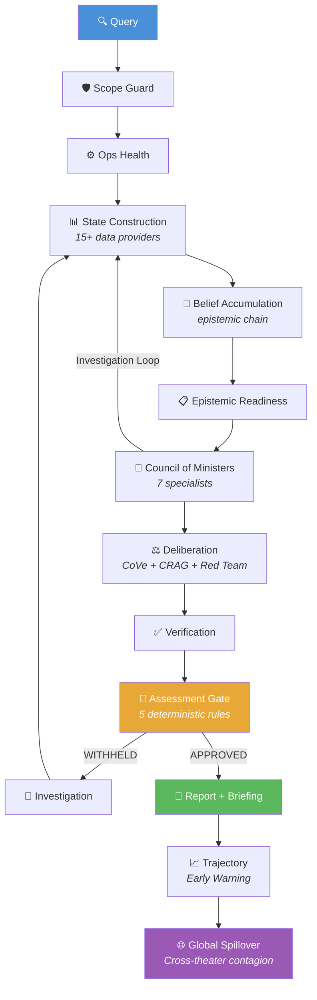

# IND-Diplomat

**Layered geopolitical intelligence engine with Bayesian state modeling, multi-agent deliberation, and evidence-backed risk assessment.**

[](https://github.com/ABHISHEK1139/IND-Diplomat/actions/workflows/ci.yml)
[](https://python.org)
[](LICENSE)
[](Dockerfile)

---

## Overview

IND-Diplomat is a research-oriented decision-support system that transforms raw geopolitical data into structured, evidence-backed intelligence assessments. It combines **15+ structured data providers**, **Bayesian conflict-state classification**, **multi-agent council reasoning**, and **deterministic assessment gating** into a transparent, auditable pipeline.

> **Technical Transferability** — The core engineering of this system — probabilistic state transitions via Hidden Markov Models, posterior belief updates under uncertainty, multi-source signal fusion, and pipeline-based decision architecture — is directly transferable to scientific data systems, detector event classification, and any domain requiring structured reasoning over noisy, heterogeneous inputs.

### Key Capabilities

- **Bayesian Conflict-State Model** — 5-state Hidden Markov Model with adaptive transition matrices and per-country prior persistence
- **Multi-Agent Council** — 7 specialist ministers (Security, Diplomatic, Economic, Domestic, Alliance, Strategy, Contrarian) with structured debate and red-team challenge
- **Monte Carlo Tree Search** — Hypothesis exploration via MCTS for scenario analysis
- **Deterministic Assessment Gate** — 5 rule-based checks (no LLM) ensuring reproducible, auditable output decisions
- **Evidence Provenance** — Full chain from raw data source → observation → belief → signal → assessment
- **White-Box Transparency** — Every reasoning step, minister report, and gate decision is inspectable via API and dashboard

## Technology Stack

```
Python 3.10+  │  FastAPI  │  Bayesian Inference  │  Monte Carlo Methods
LLM Orchestration (Ollama / OpenRouter)  │  Async/Concurrent Programming
Docker & Kubernetes  │  GitHub Actions CI/CD  │  pytest
ChromaDB (Vector Store)  │  Redis (Cache)  │  Neo4j (Graph DB)
NumPy  │  spaCy  │  Sentence-Transformers  │  Prometheus Metrics
```

## Architecture



### Layer Breakdown

| Layer | Purpose | Key Components |
|-------|---------|----------------|
| **L1 — Collection** | Data ingestion from OSINT sources | GDELT sensor, MoltBot, CAMEO mapper |
| **L2 — Knowledge** | Parsing, normalization, retrieval | Vector store, entity registry, multi-index |
| **L3 — State Model** | World-model construction | Bayesian classifier, belief accumulator, 15+ providers |
| **L4 — Analysis** | Council reasoning and deliberation | 7 ministers, CoVe, CRAG, Red Team, MCTS |
| **L5 — Judgment** | Deterministic gating and reporting | 5-rule gate, IAR-format reports |
| **L6 — Presentation** | Briefings, backtesting, learning | Replay engine, calibration, bias detection |
| **L7 — Global Model** | Multi-theater strategic analysis | 150+ coupling weights, contagion engine |

## Quick Start

### Option A: Docker (Recommended)

```bash
# Build and run
docker compose up --build

# With full infrastructure (Redis + ChromaDB)
docker compose --profile infra up --build

# Access
open http://localhost:8000
```

### Option B: Local Development

```bash
# Linux/macOS/WSL
git clone https://github.com/ABHISHEK1139/IND-Diplomat.git
cd IND-Diplomat
chmod +x scripts/configure_first_run.sh
./scripts/configure_first_run.sh
source .venv/bin/activate
python app_server.py --port 8000

# Windows PowerShell
powershell -ExecutionPolicy Bypass -File .\Scripts\configure_first_run.ps1 -InstallDependencies
.\.venv\Scripts\Activate.ps1
python app_server.py --port 8000
```

### Option C: Make (Linux/macOS)

```bash
make setup      # Create venv + install deps
make run        # Start web app
make test       # Run tests
make lint       # Code quality checks
```

### Endpoints

| Endpoint | Description |
|----------|-------------|
| `http://localhost:8000` | Dashboard UI |
| `http://localhost:8000/docs` | OpenAPI documentation |
| `http://localhost:8000/v2/query` | Quick query (POST) |
| `http://localhost:8000/api/v3/assess` | Async assessment (POST) |
| `http://localhost:8000/health` | Health check |

## Usage

### CLI

```bash
python run.py "What is driving India-Pakistan tensions?"
python run.py --country IND --date 2025-06-01 "Assess escalation risk"
python run.py --verbose --json --whitebox "Analyze South Asian stability"
python run.py --experiment all  # Run validation experiments
```

### Python API

```python
from run import diplomat_query, diplomat_query_sync

# Async
result = await diplomat_query(
    "Assess China-Taiwan risk",
    country_code="CHN",
    use_red_team=True,
    max_investigation_loops=2,
)

print(result.outcome)      # ASSESSMENT | INSUFFICIENT_EVIDENCE | OUT_OF_SCOPE
print(result.confidence)   # 0.0 – 1.0
print(result.risk_level)   # LOW | MEDIUM | HIGH | CRITICAL
print(result.briefing)     # Full intelligence briefing
```

### REST API

```bash
curl -X POST http://localhost:8000/v2/query \
  -H "Content-Type: application/json" \
  -d '{"query": "Assess India-Pakistan tensions", "country_code": "IND"}'
```

## Sample Output

### CLI Output

```
$ python run.py --country IND "Assess India-Pakistan escalation risk"

[IND-Diplomat] Checking configured LLM provider...
[IND-Diplomat] OPENROUTER OK: qwen/qwen3.6-plus-preview:free
[IND-Diplomat] Query: Assess India-Pakistan escalation risk
[IND-Diplomat] Country: IND

======================================================================
  IND-DIPLOMAT INTELLIGENCE ASSESSMENT
  [ASSESSMENT]
======================================================================
  Risk Level  : HIGH
  Confidence  : 0.732
  Trace       : dip-8a3f-20260418
  Elapsed     : 47.3s

----------------------------------------------------------------------
  INTELLIGENCE BRIEFING
----------------------------------------------------------------------
  ## Executive Summary
  Escalation risk between India and Pakistan has reached HIGH levels,
  driven primarily by military mobilization signals along the Line of
  Control and deteriorating diplomatic channels.

  ## Key Findings
  - CAPABILITY: Military force posture elevated (SIG_MIL_MOBILIZATION
    confidence: 0.81, source: GDELT event stream)
  - INTENT: Diplomatic hostility signals detected across 3 independent
    channels (SIG_DIP_HOSTILITY confidence: 0.74)
  - STABILITY: Internal political pressure reducing de-escalation space
    (SIG_INTERNAL_INSTABILITY confidence: 0.62)
  - COST: Sanctions exposure moderate; economic deterrence weakening
    (SIG_ECONOMIC_PRESSURE confidence: 0.55)

  ## Bayesian State Distribution
  PEACE: 0.08 | TENSIONS: 0.23 | ESCALATION: 0.41 | CRISIS: 0.22 | WAR: 0.06

  ## Council Deliberation Summary
  - Security Minister: HIGH risk (drivers: troop_movement, air_defense)
  - Diplomatic Minister: ELEVATED risk (drivers: recall_ambassador)
  - Economic Minister: MODERATE risk (drivers: trade_disruption)
  - Contrarian Minister: Challenged consensus on timeline assumptions
  - Red Team: Assessment ROBUST (penalty: -0.03)

  ## Assessment Gate
  Rule 1 (min_signals): PASS (12/5 required)
  Rule 2 (epistemic_coverage): PASS (4/4 SRE dimensions covered)
  Rule 3 (min_confidence): PASS (0.732 > 0.30 threshold)
  Rule 4 (safety_review): PASS
  Rule 5 (hitl_check): PASS (below CRITICAL threshold)
  Verdict: APPROVED
----------------------------------------------------------------------

  Sources (5):
    [1] GDELT_EVENT_STREAM  (score: 0.91)
    [2] ACLED_CONFLICT_DATA  (score: 0.84)
    [3] WORLDBANK_INDICATORS  (score: 0.72)
    [4] UN_VOTING_RECORDS  (score: 0.68)
    [5] DIPLOMATIC_CABLES  (score: 0.61)
```

### REST API Response (`/v2/query`)

```json
{
  "success": true,
  "outcome": "ASSESSMENT",
  "answer": "Escalation risk between India and Pakistan has reached HIGH levels...",
  "confidence": 0.7320,
  "risk_level": "HIGH",
  "trace_id": "dip-8a3f-20260418",
  "latency_ms": 47300,
  "verification": {
    "cove_verified": true,
    "crag_correction_applied": false,
    "red_team_passed": true,
    "input_safe": true,
    "output_safe": true
  },
  "gate_verdict": {
    "decision": "APPROVED",
    "rules_passed": 5,
    "rules_total": 5
  },
  "reasoning": [
    {"step": 1, "title": "Scope Check", "description": "Query validated as geopolitical assessment."},
    {"step": 2, "title": "State Construction", "description": "Built state from 15 providers for IND."},
    {"step": 3, "title": "Belief Accumulation", "description": "12 signals aggregated across 4 SRE dimensions."},
    {"step": 4, "title": "Minister: Security", "description": "Source: CAPABILITY. Confidence: 81.0%."},
    {"step": 5, "title": "Minister: Diplomatic", "description": "Source: INTENT. Confidence: 74.0%."},
    {"step": 6, "title": "Red Team Analysis", "description": "Robust: True. Penalty: -0.03."},
    {"step": 7, "title": "Final Assessment", "description": "Outcome: ASSESSMENT. Confidence: 73.2%. Risk: HIGH."}
  ]
}
```

### Analyst Dashboard (`/api/v3/assess`)

The async assessment endpoint returns a job ID for polling, with the full result including:

- **SRE Radar** — 4-dimension risk profile (Capability, Intent, Stability, Cost)
- **Evidence Chain** — Signal → source → confidence with full provenance
- **Minister Reports** — Individual reasoning from all 7 council specialists
- **Gate Audit Trail** — Every deterministic rule with pass/fail status
- **Trajectory Forecast** — Early-warning trend data with historical context

## Testing

```bash
# Full test suite
make test

# Quick smoke test
make test-smoke

# With coverage
make test-cov

# Specific test file
python -m pytest test/test_core_pipeline.py -v
```

## Configuration

Copy `.env.example` to `.env` and adjust:

```bash
cp .env.example .env
```

Key settings:

| Variable | Default | Description |
|----------|---------|-------------|
| `LLM_PROVIDER` | `ollama` | LLM backend (`ollama` or `openrouter`) |
| `LLM_MODEL` | `deepseek-r1:8b` | Model name |
| `REDIS_ENABLED` | `false` | Enable Redis caching |
| `NEO4J_ENABLED` | `false` | Enable graph database |
| `ENABLE_GLOBAL_MODEL` | `true` | Multi-theater analysis |
| `COUNCIL_SHADOW_MODE` | `true` | Ministers observe-only mode |

## Project Structure

```
IND-Diplomat/
├── engine/                    # Core pipeline layers
│   ├── Layer1_Collection/     # OSINT data ingestion
│   ├── Layer1_Sensors/        # Sensor wrappers
│   ├── Layer2_Knowledge/      # Retrieval and normalization
│   ├── Layer3_StateModel/     # Bayesian state model
│   ├── Layer4_Analysis/       # Council reasoning engine
│   ├── Layer5_Judgment/       # Assessment gate
│   ├── Layer5_Reporting/      # Intelligence reports
│   ├── Layer5_Trajectory/     # Early warning systems
│   ├── Layer6_Presentation/   # Briefing and explainability
│   ├── Layer6_Backtesting/    # Crisis replay validation
│   ├── Layer6_Learning/       # Calibration and learning
│   └── Layer7_GlobalModel/    # Cross-theater contagion
├── Config/                    # Environment-driven configuration
├── Core/                      # Shared infrastructure
├── Frontend/                  # Dashboard UI (HTML/CSS/JS)
├── API/                       # FastAPI endpoints
├── test/                      # Test suite
├── scripts/                   # Setup and utility scripts
├── Dockerfile                 # Multi-stage container build
├── docker-compose.yml         # Development stack
├── Makefile                   # Linux build interface
├── pyproject.toml             # Project metadata and tool config
└── .github/workflows/ci.yml  # CI/CD pipeline
```

## Documentation

- [Architecture](docs/architecture.md) — Pipeline design and stage breakdown
- [Repository Map](docs/repo-map.md) — Module-level documentation
- [Quick Start](QUICK_START.md) — Fastest path to running
- [Configuration Guide](CONFIGURE_AND_RUN.md) — Detailed runbook
- [Contributing](CONTRIBUTING.md) — Development standards
- [Security](SECURITY.md) — Security policy and hardening

## Validation

The system includes built-in validation tools:

- **Crisis Replay** — Day-by-day Bayesian simulation against historical crises with Brier score evaluation
- **Signal Ablation** — Tests pipeline sensitivity by removing individual signal sources
- **Lead-Time Analysis** — Measures how far in advance the system detects escalation patterns
- **Confidence Calibration** — Auto-adjustment loops for forecast accuracy

```bash
python run.py --experiment replay     # Crisis replay validation
python run.py --experiment ablation   # Signal ablation tests
python run.py --experiment leadtime   # Lead-time experiments
python run.py --experiment all        # Full validation suite
```

## License

MIT License — see [LICENSE](LICENSE) for details.
