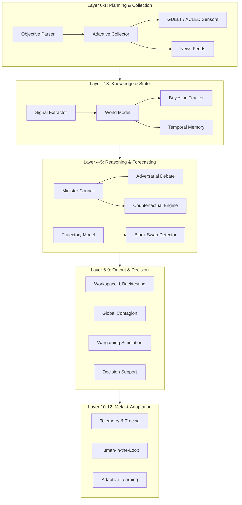

# 🌐 IND-Diplomat

**Next-generation geopolitical intelligence and head-of-country advisory system.**

[](https://www.python.org/downloads/)
[](LICENSE)
[](https://github.com/ABHISHEK1139/IND-Diplomat/actions/workflows/ci.yml)

---

IND-Diplomat is a multi-layered AI-powered intelligence analysis platform that transforms
raw OSINT signals into structured geopolitical assessments, threat forecasts, and policy
recommendations. It orchestrates a 13-layer cognitive pipeline — from data collection
through adversarial red-teaming to decision support — delivering head-of-state-grade
intelligence briefs in real time.

## Architecture


```mermaid
flowchart TB
    subgraph Collection ["Layer 0-1: Planning & Collection"]
        L0[Objective Parser] --> L1[Adaptive Collector]
        L1 --> GDELT[GDELT / ACLED Sensors]
        L1 --> NEWS[News Feeds]
    end

    subgraph Knowledge ["Layer 2-3: Knowledge & State"]
        L2[Signal Extractor] --> L3[World Model]
        L3 --> BN[Bayesian Tracker]
        L3 --> TM[Temporal Memory]
    end

    subgraph Reasoning ["Layer 4-5: Reasoning & Forecasting"]
        L4[Minister Council] --> DEBATE[Adversarial Debate]
        L4 --> CF[Counterfactual Engine]
        L5[Trajectory Model] --> BS[Black Swan Detector]
    end

    subgraph Output ["Layer 6-9: Output & Decision"]
        L6[Workspace & Backtesting]
        L7[Global Contagion]
        L8[Wargaming Simulation]
        L9[Decision Support]
    end

    subgraph Meta ["Layer 10-12: Meta & Adaptation"]
        L10[Telemetry & Tracing]
        L11[Human-in-the-Loop]
        L12[Adaptive Learning]
    end

    Collection --> Knowledge --> Reasoning --> Output --> Meta
```

## Features

- **13-Layer Cognitive Pipeline** — from OSINT collection to decision support
- **Minister Council Architecture** — multi-expert adversarial reasoning (economic, security, diplomatic, strategic)
- **Bayesian Belief Networks** — probabilistic state tracking with uncertainty quantification
- **Black Swan Detection** — early warning for low-probability / high-impact events
- **Wargaming Engine** — agent-based conflict simulation with Mesa
- **Legal RAG Pipeline** — treaty and international law grounding via vector search
- **STIX2 & OpenCTI Integration** — Standards-compliant threat intelligence sharing for enterprise SOCs
- **Web UI & WebSocket Streaming** — Live interactive dashboard to monitor the Minister Council's reasoning in real time

## 🕸️ How to Use with Web (Live Dashboard)

IND-Diplomat 3.0 includes a real-time Web UI that allows analysts to interact with the system, stream live debates from the Minister Council, and view generated STIX2 graphs.

```bash
# 1. Start the backend API and WebSocket server
python -m uvicorn dip.api:app --host 0.0.0.0 --port 8000 --reload

# 2. Open the Web UI
# The system provides a built-in static dashboard (if configured) or you can connect 
# your enterprise frontend to ws://localhost:8000/ws/{job_id}

# 3. Submit a job via REST and watch the live analysis
curl -X POST http://localhost:8000/investigate \
  -H "Content-Type: application/json" \
  -d '{"country": "India", "query": "maritime security in the Indian Ocean"}'
```

## 🚀 Quick Start (One-Click Installer)

IND-Diplomat 3.0 provides robust one-click startup scripts for both Windows and Linux/Mac. These scripts automatically handle virtual environments, dependency installation, and provide interactive menus for booting the system.

```bash
# 1. Clone the repository
git clone https://github.com/ABHISHEK1139/IND-Diplomat.git
cd IND-Diplomat

# 2. Run the interactive startup script
# On Windows:
start.bat
# On Linux/Mac:
./start.sh
```

You will be presented with the following options:
1. **Run Locally (Auto-Heal enabled)**: Installs dependencies natively and runs the API server. Highly recommended if you are running **Local AI like Ollama** on your machine to prevent GPU crashes.
2. **Run via Docker (Auto-Heal enabled)**: Builds all 13 microservices (Postgres, Redis, Neo4j, Qdrant, Workers, etc.) into an isolated, auto-healing cluster.
3. **Exit**

> [!TIP]
> **Local AI Compatibility:** If you are running Ollama or LM Studio locally on your host machine, we recommend using **Option 1 (Run Locally)**. Running heavy local LLMs alongside Docker's GPU reservations can cause violent Out-of-Memory (OOM) crashes.

> [!IMPORTANT]
> **Auto-Healing Infrastructure:** Whether you run natively or via Docker, IND-Diplomat features a dedicated Auto-Healer that continuously monitors system health and gracefully restarts any failing agents or microservices without user intervention.

## Project Structure

```
ind-diplomat/
├── src/dip/                  # All source code under dip namespace
│   ├── __init__.py
│   ├── api.py                 # FastAPI application
│   ├── run.py                 # CLI entry point
│   ├── unified_pipeline.py    # Master orchestration pipeline
│   ├── Config/                # Configuration management
│   ├── core/                  # Shared models, utilities, LLM clients
│   ├── layer0_planning/       # Objective parsing & workflow planning
│   ├── layer1_collection/     # OSINT collection (GDELT, ACLED, news)
│   ├── layer2_knowledge/      # Signal extraction & event classification
│   ├── layer3_state/          # Bayesian state tracking & world model
│   ├── layer3_world_model/    # Claim extraction & belief networks
│   ├── layer4_reasoning/      # Minister council & adversarial debate
│   ├── layer5_forecasting/    # Probabilistic forecasting
│   ├── layer5_trajectory/     # Scenario trajectories & black swans
│   ├── layer6_backtesting/    # Historical replay & evaluation
│   ├── layer6_presentation/   # Report generation & formatting
│   ├── layer6_workspace/      # Analyst workspace management
│   ├── layer7_global/         # Cross-region contagion analysis
│   ├── layer7_learning/       # Model calibration & learning
│   ├── layer8_collaboration/  # Multi-analyst collaboration
│   ├── layer8_wargaming/      # Agent-based wargame simulation
│   ├── layer9_decision/       # Decision support & recommendations
│   ├── layer9_ecosystem/      # Plugin ecosystem & SDK
│   ├── layer10_enterprise/    # Enterprise integrations
│   ├── layer10_telemetry/     # Observability & tracing
│   ├── layer11_hitl/          # Human-in-the-loop review
│   ├── layer11_research/      # Research & experimentation
│   ├── layer12_adaptive/      # Adaptive learning loops
│   ├── deliberation/          # Chain-of-Verification & CRAG
│   ├── decision/              # Threat synthesis & consistency
│   ├── legal/                 # Treaty RAG & legal analysis
│   ├── memory/                # Investigation & calibration memory
│   ├── nextgen/               # Experimental modules
│   └── SystemGuardian/        # System health monitoring
├── tests/                     # All test suites
├── scripts/                   # Utility & deployment scripts
├── docker/                    # Dockerfiles & compose configs
├── docs/                      # Documentation
├── pyproject.toml             # Build configuration
├── requirements.txt           # Pinned dependencies
└── .github/workflows/ci.yml   # CI pipeline
```

## 🧠 Depth and Breadth of the 13 Layers

IND-Diplomat 3.0 provides unparalleled breadth and depth across 13 distinct cognitive layers:

1. **Layer 0 (Planning)**: Formulates specific intelligence collection objectives based on raw user queries.
2. **Layer 1 (Collection)**: Plugs into OSINT APIs (GDELT, ACLED, news scrapers) to gather unstructured signals.
3. **Layer 2 (Knowledge)**: Extracts entities, relationships, and geopolitical events from raw text.
4. **Layer 3 (State/World Model)**: Maintains a Bayesian Belief Network and temporal memory of all ongoing global events.
5. **Layer 4 (Reasoning)**: The core engine. A multi-agent **Minister Council** (Strategy, Security, Economy, Diplomacy) debates evidence, challenges biases via a **Red Team**, and fetches missing data using **CRAG**.
6. **Layer 5 (Forecasting)**: Projects current signals into future trajectories and detects low-probability **Black Swan** events.
7. **Layer 6 (Workspace)**: Generates Head-of-State dossiers, STIX2 bundles, and executive summaries.
8. **Layer 7 (Global Contagion)**: Models how a crisis in one theater propagates economically or militarily to other nations.
9. **Layer 8 (Wargaming)**: Uses Mesa agent-based simulations to compute Nash Equilibriums for conflict scenarios.
10. **Layer 9 (Decision)**: Synthesizes final threat assessments and refusal gates.
11. **Layer 10 (Enterprise/Telemetry)**: Full OpenTelemetry tracing and Langfuse observability.
12. **Layer 11 (HITL/Research)**: Halts the pipeline for human-in-the-loop review on critical decisions.
13. **Layer 12 (Adaptive)**: Self-model updates and reinforcement learning from past forecasts.

## 🔌 API Usage

```python
from dip.unified_pipeline import execute
import asyncio

# Run a full intelligence assessment programmatically
async def run_assessment():
    result = await execute(
        query="maritime security in the Indian Ocean",
        country_code="IN",
        job_id="test-job-123"
    )
    print(result.get("briefing"))
    print("STIX2 Bundle:", result.get("stix2_bundle"))

asyncio.run(run_assessment())
```

### REST API

```bash
# Start the API server
uvicorn dip.api:app --host 0.0.0.0 --port 8000

# Submit an investigation
curl -X POST http://localhost:8000/investigate \
  -H "Content-Type: application/json" \
  -d '{"country": "India", "topic": "border security"}'
```


## Contributing

See [CONTRIBUTING.md](CONTRIBUTING.md) for development guidelines, coding standards, and PR workflow.

## License

This project is proprietary software. See [LICENSE](LICENSE) for details.
