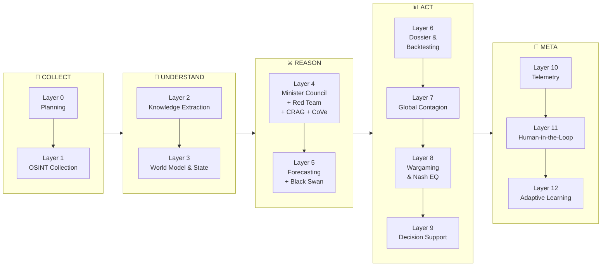
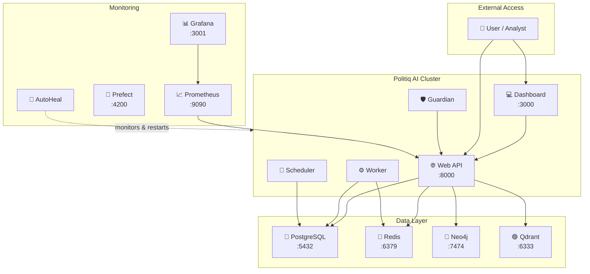

# 🧠 Politiq AI

**Next-generation geopolitical intelligence platform. Head-of-state advisory powered by a 13-layer cognitive pipeline.**

[](https://www.python.org/downloads/)
[](https://fastapi.tiangolo.com/)
[](https://www.docker.com/)
[](LICENSE)

---

## What is Politiq AI?

Politiq AI is an AI-powered intelligence analysis system that transforms raw open-source intelligence (OSINT) signals into structured geopolitical assessments, threat forecasts, and policy recommendations.

It orchestrates a **13-layer cognitive pipeline** — from real-time data collection through adversarial red-teaming to decision support — delivering **head-of-state-grade intelligence briefs** in real time.

> Think of it as an autonomous intelligence analyst that collects signals from the world, debates them through a council of AI ministers, stress-tests every conclusion, and produces a final threat assessment — all in a single API call.

---

## 🏗️ How It Works — The Pipeline

Every query flows through 13 sequential layers. Each layer refines, challenges, and enriches the analysis before passing it forward.


```mermaid
flowchart LR
    subgraph COLLECT["📡 COLLECT"]
        L0["Layer 0\nPlanning"] --> L1["Layer 1\nOSINT Collection"]
    end

    subgraph UNDERSTAND["🧩 UNDERSTAND"]
        L2["Layer 2\nKnowledge Extraction"] --> L3["Layer 3\nWorld Model & State"]
    end

    subgraph REASON["⚔️ REASON"]
        L4["Layer 4\nMinister Council\n+ Red Team\n+ CRAG + CoVe"] --> L5["Layer 5\nForecasting\n+ Black Swan"]
    end

    subgraph ACT["📊 ACT"]
        L6["Layer 6\nDossier &\nBacktesting"] --> L7["Layer 7\nGlobal Contagion"]
        L7 --> L8["Layer 8\nWargaming\n& Nash EQ"]
        L8 --> L9["Layer 9\nDecision Support"]
    end

    subgraph META["🔄 META"]
        L10["Layer 10\nTelemetry"] --> L11["Layer 11\nHuman-in-the-Loop"]
        L11 --> L12["Layer 12\nAdaptive Learning"]
    end

    COLLECT --> UNDERSTAND --> REASON --> ACT --> META
```

### Pipeline Stages Explained

| Phase | Layers | What Happens |
|---|---|---|
| **📡 Collect** | 0 → 1 | Parses the user's query into intelligence objectives. Pulls real-time signals from **GDELT**, **ACLED**, news feeds, and OSINT sensors. |
| **🧩 Understand** | 2 → 3 | Extracts entities, relationships, and events from raw text. Builds a **Bayesian Belief Network** and temporal world model with uncertainty tracking. |
| **⚔️ Reason** | 4 → 5 | The core brain. A **Council of Ministers** (Security, Strategy, Economy, Diplomacy, Contrarian) debates hypotheses. A **Red Team** challenges biases. **CRAG** fetches missing evidence. **CoVe** decomposes and verifies every claim. Forecasting projects trajectories and detects **Black Swan** events. |
| **📊 Act** | 6 → 9 | Generates executive dossiers and STIX2 bundles. Models **global contagion** (how a crisis in one region propagates). Runs **agent-based wargaming** with Nash Equilibrium computation. Synthesizes final **threat assessment** and **decision recommendations**. |
| **🔄 Meta** | 10 → 12 | Full **OpenTelemetry tracing** and Langfuse observability. Halts for **human-in-the-loop review** on high-risk decisions. **Adaptive learning** recalibrates the system from past forecasts. |

---

## ⚡ Key Capabilities

| Capability | Description |
|---|---|
| **Minister Council** | Multi-expert adversarial reasoning. Five specialized AI ministers debate, then a merged heuristic + AI consensus is produced. |
| **Red Team & CRAG** | Automatic bias detection and evidence gap analysis. Missing signals trigger autonomous re-investigation. |
| **Chain of Verification (CoVe)** | Every claim is decomposed into atomic facts and independently verified before the final assessment is issued. |
| **Refusal Gate** | If verification fails, the system **refuses to issue an assessment** rather than produce unreliable intelligence. |
| **Black Swan Detection** | Early warning system for low-probability, high-impact geopolitical events. |
| **Wargaming Engine** | Agent-based conflict simulation (Mesa) with Nash Equilibrium game theory computation. |
| **Legal RAG Pipeline** | International treaty and law grounding via vector search to ensure legal accuracy. |
| **STIX2 & OpenCTI** | Standards-compliant threat intelligence export for enterprise SOC integration. |
| **Real-time WebSocket** | Live streaming of the Minister Council's deliberation to the Web dashboard. |
| **Auto-Healing** | Both local and Docker deployments feature continuous health monitoring with automatic restarts. |

---

## 🚀 Quick Start — One-Click Installer

Politiq AI provides fully automated startup scripts. No manual dependency management required.

```bash
# 1. Clone the repository
git clone https://github.com/ABHISHEK1139/IND-Diplomat.git
cd IND-Diplomat

# 2. Run the interactive startup script
# Windows:
start.bat

# Linux / Mac:
chmod +x start.sh && ./start.sh
```

You will see an interactive menu:

| Option | What It Does |
|---|---|
| **1. Run Locally** | Creates a Python virtual environment, installs all dependencies, and starts the API server with auto-heal. |
| **2. Run via Docker** | Builds and launches the full microservice cluster (Postgres, Redis, Neo4j, Qdrant, Web, Workers, Guardian, Grafana, Prometheus) with auto-heal. |
| **3. Exit** | Exits the installer. |

> [!TIP]
> **Running Ollama or LM Studio locally?** Choose **Option 1 (Run Locally)**. Running local LLMs alongside Docker GPU reservations can cause severe Out-of-Memory crashes.

> [!IMPORTANT]
> **Auto-Healing is built-in.** Whether you run locally or via Docker, Politiq AI continuously monitors system health and automatically restarts any failing services without manual intervention.

---

## 🔌 API Reference

Politiq AI exposes a full REST + WebSocket API via FastAPI.

### Submit an Assessment (Synchronous)

```bash
curl -X POST http://localhost:8000/api/assess \
  -H "Content-Type: application/json" \
  -d '{"query": "maritime security in the Indian Ocean", "country": "IND"}'
```

### Submit an Assessment (Async Job)

```bash
# Start a background job
curl -X POST http://localhost:8000/api/v3/assess \
  -H "Content-Type: application/json" \
  -d '{"query": "border tensions in South Asia", "country": "IND"}'

# Response: { "job_id": "abc-123", "status_url": "/api/v3/jobs/abc-123" }

# Poll for results
curl http://localhost:8000/api/v3/jobs/abc-123/result
```

### Live WebSocket Streaming

```javascript
const ws = new WebSocket("ws://localhost:8000/ws/abc-123");
ws.onmessage = (event) => {
    const data = JSON.parse(event.data);
    console.log(`Phase: ${data.phase} — Status: ${data.type}`);
};
```

### Full API Endpoints

| Method | Endpoint | Description |
|---|---|---|
| `POST` | `/api/assess` | Synchronous full assessment |
| `POST` | `/api/v3/assess` | Async job submission |
| `GET` | `/api/v3/jobs` | List all jobs |
| `GET` | `/api/v3/jobs/{id}` | Job status |
| `GET` | `/api/v3/jobs/{id}/result` | Full result payload |
| `GET` | `/api/v3/jobs/{id}/evidence` | Evidence log & fuzzy trace |
| `GET` | `/api/v3/jobs/{id}/verification` | Verification score & red team report |
| `GET` | `/api/v3/trends/{country}` | Historical threat trends |
| `GET` | `/api/v3/alerts/{country}` | High-threat alerts |
| `POST` | `/api/head-of-country` | Head-of-state briefing |
| `WS` | `/ws/{job_id}` | Live pipeline streaming |
| `GET` | `/health` | Health check + OSS adapter status |
| `GET` | `/metrics` | Prometheus metrics |

### Python SDK

```python
from dip.unified_pipeline import execute
import asyncio

async def run():
    result = await execute(
        query="maritime security in the Indian Ocean",
        country_code="IND",
        job_id="analysis-001"
    )
    
    print(f"Threat Level: {result['threat_level']}")
    print(f"Verification: {result['verification_score']:.0%}")
    print(f"Black Swan:   {result.get('black_swan', {}).get('triggered', False)}")
    print(f"Briefing:     {result.get('briefing', 'N/A')[:200]}")

asyncio.run(run())
```

---

## 📁 Project Structure

```
politiq-ai/
├── src/dip/                        # Core intelligence engine
│   ├── api.py                      # FastAPI server (REST + WebSocket)
│   ├── unified_pipeline.py         # Master 13-layer orchestrator
│   ├── Config/                     # Environment & runtime configuration
│   ├── core/                       # Shared models, schemas, LLM clients
│   │
│   ├── layer0_planning/            # Intelligence objective parsing
│   ├── layer1_collection/          # OSINT feeds (GDELT, ACLED, News)
│   ├── layer2_knowledge/           # Entity & signal extraction
│   ├── layer3_state/               # Bayesian belief network & world model
│   ├── layer4_reasoning/           # Minister Council & adversarial debate
│   │   └── ministers/              # Security, Strategy, Economy, Diplomacy, Contrarian
│   ├── layer5_forecasting/         # Probabilistic forecasting & Monte Carlo
│   ├── layer5_trajectory/          # Black swan detection & scenario engine
│   ├── layer6_backtesting/         # Historical crisis replay & evaluation
│   ├── layer6_workspace/           # Analyst workspace & dossier composer
│   ├── layer7_global/              # Cross-region contagion modeling
│   ├── layer7_learning/            # Model calibration & fine-tuning
│   ├── layer8_collaboration/       # Multi-analyst workspace & RBAC
│   ├── layer8_wargaming/           # Mesa simulations & Nash equilibrium
│   ├── layer9_decision/            # Final threat synthesis
│   ├── layer9_ecosystem/           # Plugin SDK & extensions
│   ├── layer10_enterprise/         # Kubernetes deployments & monitoring
│   ├── layer10_telemetry/          # OpenTelemetry & Langfuse tracing
│   ├── layer11_hitl/               # Human-in-the-loop review gates
│   ├── layer11_research/           # Experimental modules
│   ├── layer12_adaptive/           # Self-learning & reinforcement loops
│   │
│   ├── deliberation/               # Red Team, CRAG, CoVe engines
│   ├── decision/                   # Threat synthesizer & refusal gate
│   ├── legal/                      # Treaty RAG & international law
│   ├── memory/                     # Investigation memory & calibration
│   ├── nextgen/                    # STIX2, LangGraph, Prefect adapters
│   └── SystemGuardian/             # System health monitoring
│
├── docker/                         # Dockerfiles & Compose configs
│   ├── docker-compose.yml          # Full production cluster (11 containers)
│   └── docker-compose.dev.yml      # Development hot-reload
├── deploy/                         # Prometheus & Grafana configurations
├── frontend-next/                  # Next.js Web Dashboard
├── tests/                          # 40+ test suites (unit, integration, E2E)
├── scripts/                        # Utility & deployment scripts
├── docs/                           # Architecture & deployment docs
│
├── start.bat                       # Windows one-click installer
├── start.sh                        # Linux/Mac one-click installer
├── pyproject.toml                  # Build configuration & dependencies
├── requirements.txt                # Pinned dependency versions
└── .github/workflows/ci.yml        # CI/CD pipeline
```

---

## 🐳 Docker Architecture

When launched via Docker, Politiq AI spins up a complete, self-healing microservice cluster:


```mermaid
graph TB
    subgraph External["External Access"]
        USER["👤 User / Analyst"]
    end

    subgraph Services["Politiq AI Cluster"]
        WEB["🌐 Web API\n:8000"]
        FRONTEND["💻 Dashboard\n:3000"]
        WORKER["⚙️ Worker"]
        SCHEDULER["📅 Scheduler"]
        GUARDIAN["🛡️ Guardian"]
    end

    subgraph Data["Data Layer"]
        PG["🐘 PostgreSQL\n:5432"]
        REDIS["🔴 Redis\n:6379"]
        NEO4J["🔵 Neo4j\n:7474"]
        QDRANT["🟣 Qdrant\n:6333"]
    end

    subgraph Observability["Monitoring"]
        PROM["📈 Prometheus\n:9090"]
        GRAF["📊 Grafana\n:3001"]
        PREFECT["🔧 Prefect\n:4200"]
        AUTOHEAL["💊 AutoHeal"]
    end

    USER --> FRONTEND --> WEB
    USER --> WEB
    WEB --> PG & REDIS & NEO4J & QDRANT
    WORKER --> PG & REDIS
    SCHEDULER --> PG
    GUARDIAN --> WEB
    PROM --> WEB
    GRAF --> PROM
    AUTOHEAL -.->|monitors & restarts| Services
```

---

## ⚙️ Configuration

Copy the example environment file and configure your API keys:

```bash
cp .env.example .env
```

### Required Keys

| Variable | Description |
|---|---|
| `OPENAI_API_KEY` | OpenAI API key (or use OpenRouter / Ollama) |
| `LLM_MODEL` | Model to use (default: `gpt-4o`) |
| `LLM_PROVIDER` | Provider: `openai`, `openrouter`, `ollama` |

### Optional Integrations

| Variable | Description |
|---|---|
| `ACLED_API_KEY` | ACLED conflict data API |
| `GDELT_API_KEY` | GDELT event monitoring |
| `OLLAMA_BASE_URL` | Local Ollama endpoint (default: `http://localhost:11434`) |
| `DIP_OTEL_ENABLED` | Enable OpenTelemetry tracing (`0` / `1`) |
| `DIP_MLFLOW_ENABLED` | Enable MLflow experiment tracking |
| `DIP_LANGGRAPH_ENABLED` | Enable LangGraph workflow adapter |
| `DIP_STIX2_ENABLED` | Enable STIX2 threat intelligence export |

---

## 🤝 Contributing

See [CONTRIBUTING.md](CONTRIBUTING.md) for development setup, coding standards, and PR workflow.

## 📄 License

This project is proprietary software. See [LICENSE](LICENSE) for details.
