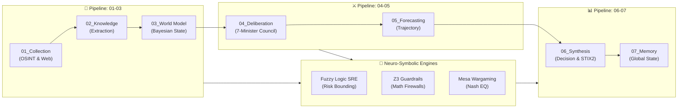

# 🌐 Politiq AI (DIP 3.0 Engine)
**Next-generation geopolitical intelligence platform. Head-of-state advisory powered by a Neuro-Symbolic Cognitive Pipeline.**

Politiq AI (DIP 3.0) is an autonomous intelligence analysis system that transforms raw open-source intelligence (OSINT) signals into structured geopolitical assessments, threat forecasts, and policy recommendations. 

It orchestrates a heavily structured cognitive pipeline—from real-time data collection, to fuzzy logic signal processing, to adversarial AI red-teaming, and agent-based game theory wargaming.

Think of it as an autonomous intelligence analyst that collects signals from the world, debates them through a council of AI ministers, stress-tests the math via Symbolic Guardrails, predicts counter-moves via Nash Equilibrium, and produces a final STIX2 threat assessment—all in a single API call.

---

## 🏗️ How It Works — The DIP 3.0 Architecture

The messy 13-layer system has been fully refactored into a pristine, 4-tier architecture (`core`, `api`, `engines`, and `pipeline`).


```mermaid
flowchart LR
    subgraph COLLECT["📡 Pipeline: 01-03"]
    L1["01_Collection\n(OSINT & Web)"] --> L2["02_Knowledge\n(Extraction)"]
    L2 --> L3["03_World Model\n(Bayesian State)"]
    end
    
    subgraph REASON["⚔️ Pipeline: 04-05"]
    L3 --> L4["04_Deliberation\n(7-Minister Council)"]
    L4 --> L5["05_Forecasting\n(Trajectory)"]
    end
    
    subgraph ENGINES["🧠 Neuro-Symbolic Engines"]
    F["Fuzzy Logic SRE\n(Risk Bounding)"]
    Z3["Z3 Guardrails\n(Math Firewalls)"]
    NASH["Mesa Wargaming\n(Nash EQ)"]
    end
    
    subgraph ACT["📊 Pipeline: 06-07"]
    L5 --> L6["06_Synthesis\n(Decision & STIX2)"]
    L6 --> L7["07_Memory\n(Global State)"]
    end
    
    COLLECT --> ENGINES
    REASON --> ENGINES
    ENGINES --> ACT
```

### ⚡ Advanced Neuro-Symbolic Capabilities

*   **Fuzzy Logic State Readiness (SRE)**: Replaces standard LLM hallucinations with deterministic mathematics. Uses triangular and trapezoidal membership curves to bound geopolitical signal intensity into a strict `[0,1]` Escalation Score.
*   **Symbolic Guardrails (Z3 & pyDatalog)**: A mathematical firewall that sits behind the LLM. If the AI generates a narrative saying "Threat is Low," but the SRE math calculates a `0.8` Escalation Score, the Z3 Solver mathematically detects the contradiction and rejects the output.
*   **Mesa Wargaming (Nash Equilibrium)**: Uses agent-based Mesa simulations to wargame kinetic and diplomatic counter-moves, automatically computing the optimal Nash Equilibrium defense strategy.
*   **7-Minister Council**: Multi-expert adversarial reasoning. Five specialized AI ministers (Security, Strategy, Economy, Diplomacy, Contrarian) debate hypotheses, then a merged heuristic consensus is produced.
*   **Chain of Verification (CoVe) & CRAG**: Every claim is decomposed into atomic facts and independently verified before the final assessment is issued. Missing signals trigger autonomous web-surfer re-investigation.

---

## 🚀 Quick Start — One-Click Installer

Politiq AI 3.0 provides a fully automated startup script. No manual dependency management required!

```bash
# 1. Clone the repository
git clone https://github.com/ABHISHEK1139/IND-Diplomat.git
cd IND-Diplomat

# 2. Run the interactive startup script
# Windows:
start.bat

# Linux / Mac:
chmod +x start.sh && ./start.sh
```

**What the script does automatically:**
1.  Detects/Creates your `.env` keys.
2.  Builds the Python `venv` and installs all dependencies (including `z3-solver` and `pyDatalog`).
3.  Runs `npm install` for the Next.js Web Dashboard.
4.  Concurrently boots the FastAPI Python backend and the Next.js frontend in separate windows.

---

## 🔌 API Reference

Politiq AI exposes a full REST + WebSocket API via FastAPI.

**Submit an Assessment (Synchronous)**
```bash
curl -X POST http://localhost:8000/api/assess \
     -H "Content-Type: application/json" \
     -d '{"query": "maritime security in the Indian Ocean", "country": "IND"}'
```

**Live WebSocket Streaming**
```javascript
const ws = new WebSocket("ws://localhost:8000/ws/abc-123");
ws.onmessage = (event) => {
    const data = JSON.parse(event.data);
    console.log(`Phase: ${data.phase} — Status: ${data.type}`);
};
```

---

## 📁 Project Structure (DIP 3.0)

```text
dip 3.0/
├── src/dip/
│   ├── api/                  # FastAPI routes & WebSockets
│   ├── core/                 # Config, Schema, Pydantic Models
│   ├── engines/              # SRE Fuzzy Logic, Z3 Guardrails, Wargaming
│   ├── pipeline/             # The 7-Stage Intelligence Pipeline
│   │   ├── 01_collection/    # OSINT, Sensors, Web Surfing
│   │   ├── 02_knowledge/     # Entity Extraction
│   │   ├── 03_world_model/   # Bayesian Networks
│   │   ├── 04_deliberation/  # Minister Council & Debate
│   │   ├── 05_forecasting/   # Monte Carlo & Scenarios
│   │   ├── 06_synthesis/     # Decision Core & Reporting
│   │   └── 07_memory/        # Global Contagion & State
│   └── runtime/              # Graph execution & Control Loops
├── frontend-next/            # Next.js Web Dashboard
├── tests/                    # 160+ Passing Unit & E2E Tests
└── start.bat                 # One-Click Launch Script
```

---

## ⚙️ Configuration

Copy `.env.example` to `.env` and configure your API keys:

| Variable | Description |
| :--- | :--- |
| `OPENAI_API_KEY` | OpenAI API key (or use OpenRouter / Ollama) |
| `LLM_MODEL` | Model to use (default: `gpt-4o`) |
| `ACLED_API_KEY` | ACLED conflict data API (Optional) |
| `GDELT_API_KEY` | GDELT event monitoring (Optional) |

---
## 🤝 Contributing
See `CONTRIBUTING.md` for development setup, coding standards, and PR workflow.

## 📄 License
This project is proprietary software. See `LICENSE` for details.
