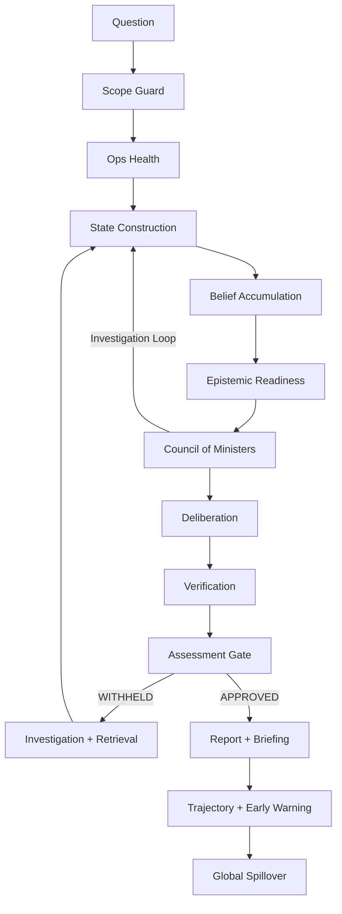

# IND-Diplomat Architecture

## Canonical Flow

The canonical pipeline is an 8-stage process orchestrated by the `CouncilCoordinator` (Layer 4) with supporting layers:



## Stage Breakdown

### 1. Scope Check

The pipeline decides whether the question belongs inside grounded geopolitical analysis. Questions that fail the scope guard exit early with an `OUT_OF_SCOPE` outcome instead of flowing into the reasoning stack.

### 2. Ops Health

Before deeper analysis, the system checks operational dependencies (LLM connectivity, provider availability) and emits warnings about degraded services. When services such as the local LLM are unavailable, the system degrades to pressure-based reasoning instead of failing.

### 3. State Construction (Layer 3)

This is the world-model layer. It pulls together:

- **Signal confidence** from 15+ structured data providers (SIPRI, ATOP, V-Dem, OFAC, GDELT, WorldBank, Comtrade, Lowy, UCDP, EEZ, Leaders, Ports, Sanctions, MoltBot)
- **Country and relationship state** from dedicated state builders
- **Temporal memory** — belief evolution history, trend indicators, momentum/persistence/spike detection
- **Credibility scoring** — source weighting, contradiction detection
- **Evidence provenance** — tracking which sources contributed to each signal

### 4. Bayesian Conflict-State Classification

A core Layer 3 component that classifies each country into one of 5 states:

```
PEACE → CRISIS → LIMITED_STRIKES → ACTIVE_CONFLICT → FULL_WAR
```

**Architecture layers:**
1. **Gaussian likelihood** — Measures how well observed signal values match expected values for each state, with per-group adaptive sigma
2. **Bayesian update** — Combines prior probabilities + likelihoods + transition matrix to produce posterior state probabilities
3. **Adaptive transition matrix** — Expert-initialized (no skip jumps), updated through Bayesian learning at rate 0.01 per run
4. **Persistence** — Prior state probabilities saved per country between runs (disabled during backtesting)

### 5. Belief Accumulation

Converts raw evidence into grounded beliefs through a strict epistemic chain:

```
Evidence (raw text) → Observation ("I think I saw X") → Belief ("X is happening")
```

Key mechanisms:
- **Source reliability tiers** — Each source type weighted (e.g., SIGINT > GDELT_EVENT > NEWS > BLOG)
- **Corroboration thresholds** — Signals must reach a promotion threshold (default 0.40) to become beliefs
- **Recency decay** — Exponential decay with 72-hour half-life
- **Staleness protection** — Linear penalty for old articles (prevents resurfaced content faking spikes)
- **Source diversity bonus** — Multi-sensor agreement earns 0.10–0.20 boost, capped at 0.20
- **Echo deduplication** — Same-origin observations collapse to 1

### 6. Signal Projection

Pure projection layer converts `StateContext` into structured `ObservedSignal` objects:

- **Temporal decay** — Dimension-specific exponential decay (capability half-life ~87 days, sanctions ~693 days)
- **Namespace classification** — Separates empirical signals (sensor-derived) from legal signals
- **Document support scoring** — Evaluates how well retrieved documents support each signal
- **Source URL tracking** — Maps each signal back to its authoritative data source

### 7. Epistemic Readiness

Decides whether the evidence base is strong enough to support analysis. If too thin, triggers investigation loops and follow-up retrieval. If coverage is still insufficient after investigation, returns `INSUFFICIENT_EVIDENCE`.

### 8. Council Reasoning (Layer 4)

The `CouncilCoordinator` (2646 lines) executes an 8-stage pipeline:

| Stage | Method | Description |
|---|---|---|
| 1. Deliberation | `convene_council()` | 7 ministers propose hypotheses over state dimensions |
| 2. Conflict Detection | `_detect_conflicts()` | Checks if causal dimensions contradict |
| 3. Red Team | `_run_red_team()` | 6-dimension challenge (military, diplomatic, economic, domestic, confidence, evidence thinness) |
| 4. Synthesis | `_synthesize_decision()` | Fuses state evidence with minister signals into a threat level |
| 5. Verification | `_verify_claims()` + `_run_full_verification()` | CoVe atomic claim decomposition + grounding verification |
| 6. Refusal | `_check_refusal_threshold()` | Rejects assessments with invalid state, anomaly interrupts, or weak causal grounding |
| 7. HITL | `_check_hitl_threshold()` | Flags high-impact predictions with low certainty for human review |
| 8. Safety | `_run_safety_review()` | Mandatory final safety gate |

**Ministers (7):**
- Security — military capability, force posture, mobilization
- Diplomatic — alliance dynamics, diplomatic signals
- Economic — trade flows, sanctions, economic pressure
- Domestic — internal stability, regime legitimacy
- Alliance — collective defense obligations
- Strategy — long-term strategic calculus
- Contrarian — deliberately challenges consensus

### 9. Deliberation Components

- **CoVe (Chain of Verification)** — Decomposes draft answers into atomic claims, verifies each against evidence provenance, produces a grounding score
- **CRAG (Corrective RAG)** — Evaluates evidence quality before reasoning; triggers retrieval when base is insufficient
- **Red Team Agent** — State-grounded challenge across 6 dimensions; falls back to simple logic if agent fails
- **Debate Orchestrator** — Multi-round structured debate between minister positions
- **Investigation Controller** — Manages investigation loops, knowledge sufficiency checks

### 10. Hypothesis Testing

- **MCTS** — Monte Carlo Tree Search for scenario exploration via hypothesis tree expansion
- **Causal Analysis** — Builds directed causal graphs to test escalation pathways
- **Perspective Agents** — Multiple analytical lenses evaluate the same evidence independently
- **Hypothesis Expander** — Generates alternative explanations to challenge the dominant narrative
- **Counterfactual Engine** — Tests "what if" scenarios against the state model

### 11. Assessment Gate (Layer 5)

Five deterministic rules (no LLM) decide APPROVED or WITHHELD:

1. **Critical PIRs** — System itself requested ≥3 Priority Intelligence Requirements → WITHHELD
2. **Capability Coverage** — Military data < 35% → WITHHELD
3. **Stale Military** — Signal recency < 10% → WITHHELD
4. **Confidence Floor** — Analytic confidence < 55% → WITHHELD
5. **Trend Escalation** — Rising momentum/persistence but LOW assessment → override to MEDIUM

### 12. Judgment and Reporting

Later layers convert the council result into inspectable outputs:

- **Intelligence report** — IAR-format intelligence assessment
- **Briefing builder** — Full multi-section briefing
- **View modules** — Evidence provenance, debate transcript, legal framework, gap analysis, red team summary, confidence explanation
- **Bias detector** — Flags analytical biases in the output
- **Failure modes** — Documents and detects system failure patterns

### 13. Trajectory and Early Warning

- **Acceleration detector** — Identifies escalation acceleration
- **Black Swan detector** — 3 channels: spike severity (>3.5σ), velocity, systemic cascade
- **Trajectory model** — Forward projection of conflict state probabilities
- **Narrative index** — Tracks event narrative arcs and GKG themes

### 14. Global Model (Layer 7)

Extends single-theater analysis to multi-theater:

- **Interdependence matrix** — 150+ expert-defined coupling weights (e.g., RUS→UKR: 0.90, IRN→ISR: 0.75, CHN→TWN: 0.80)
- **Contagion engine** — Models escalation propagation between coupled theaters
- **Cross-theater forecaster** — Projects risk across the geopolitical network
- **Global state** — Unified view across all active theaters

## Explainability and Validation Surfaces

- **Explainability**: Council reasoning summaries, minister drivers and gaps, confidence framing, Layer 6 briefing views (evidence, debate, legal, gaps, red team)
- **Investigation**: Evidence-gap detection, follow-up retrieval planning, CRAG-based quality evaluation, insufficient-evidence handling
- **Dashboard**: Reasoning, reliability, and explainability tabs in the frontend
- **Validation**: Crisis replay (Brier scores), signal ablation, lead-time experiments
- **Learning**: Confidence recalibration, forecast archiving, auto-adjustment loops

## Layer Families In The Repo

### Layer 1: Collection and Sensors

- `Layer1_Collection/` — GDELT sensor, MoltBot observation extractor, CAMEO mapper, relevance filter
- `Layer1_Sensors/` — Lightweight OSINT and MoltBot sensor wrappers, observation factory

### Layer 2: Knowledge

- `Layer2_Knowledge/` — Parsing, normalization, retrieval, source translation, storage, signal extraction, legal signal extraction, entity registry, vector store, multi-index, engrams

### Layer 3: State Model

- `Layer3_StateModel/` — Bayesian conflict-state model (5 states), belief accumulator (epistemic chain), signal projection (temporal decay), temporal memory (trend intelligence), signal registry (ontology), causal signal mapper, strategic constraints, evidence support, 15+ data providers

### Layer 4: Analysis

- `Layer4_Analysis/` — Council coordinator (8-stage pipeline), 7 ministers, deliberation (CoVe, CRAG, Red Team, Debate), hypothesis (MCTS, causal, perspective agents), investigation controller, epistemic needs, curiosity controller, counterfactual engine, groupthink detector, domain fusion, escalation index, war index

### Layer 5: Judgment, Reporting, and Trajectory

- `Layer5_Judgment/` — Assessment gate (5 deterministic rules), assessment record, report formatter
- `Layer5_Reporting/` — Intelligence report generation (IAR format)
- `Layer5_Trajectory/` — Trajectory model, acceleration detector, black swan detector (3 channels), narrative index, GKG ingestor

### Layer 6: Presentation, Backtesting, and Learning

- `Layer6_Presentation/` — Briefing builder, report builder, bias detector, confidence explainer, failure modes, 5 view modules (evidence, debate, legal, gap, red team)
- `Layer6_Backtesting/` — Replay engine (day-by-day Bayesian simulation), scenario registry, crisis registry, calibration metrics, multiclass metrics, evaluator, exporter
- `Layer6_Learning/` — Auto adjuster, calibration engine, confidence recalibrator, forecast archive, forecast resolution, learning report

### Layer 7: Global Model

- `Layer7_GlobalModel/` — Interdependence matrix (150+ couplings), contagion engine, cross-theater forecaster, global state, global report

## Documentation Guidance

Center public documentation on:

- Bayesian state model and evidence-backed reasoning
- Guarded analysis with explicit gates and refusal paths
- State construction and epistemic chain (evidence → observation → belief)
- Validation and replay utilities with proper metrics
- Layered architecture with explicit gates at every stage
- Safety architecture (refusal, HITL, groupthink detection)
